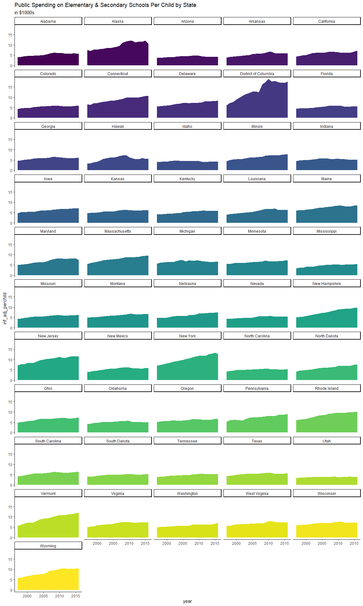
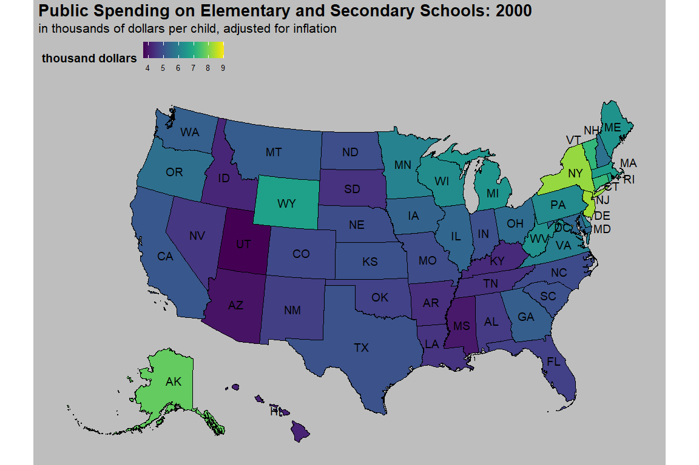

Tidy Tuesday: 9/15/2020 - US Spending on Kids
================
Ashlyn Johnson
9/15/2020

## Packages

``` r
library(tidyverse)
library(tidytuesdayR)
library(viridis)
library(urbnmapr)
library(gganimate)
library(transformr)
library(ggthemes)
library(gifski)
```

## Session Information

    ## R version 4.0.2 (2020-06-22)
    ## Platform: x86_64-w64-mingw32/x64 (64-bit)
    ## Running under: Windows 10 x64 (build 19042)
    ## 
    ## Matrix products: default
    ## 
    ## locale:
    ## [1] LC_COLLATE=English_United States.1252 
    ## [2] LC_CTYPE=English_United States.1252   
    ## [3] LC_MONETARY=English_United States.1252
    ## [4] LC_NUMERIC=C                          
    ## [5] LC_TIME=English_United States.1252    
    ## 
    ## attached base packages:
    ## [1] stats     graphics  grDevices utils     datasets  methods   base     
    ## 
    ## other attached packages:
    ##  [1] gifski_0.8.6        ggthemes_4.2.0      transformr_0.1.3   
    ##  [4] gganimate_1.0.6     urbnmapr_0.0.0.9002 viridis_0.5.1      
    ##  [7] viridisLite_0.3.0   tidytuesdayR_1.0.1  forcats_0.5.0      
    ## [10] stringr_1.4.0       dplyr_1.0.2         purrr_0.3.4        
    ## [13] readr_1.3.1         tidyr_1.1.2         tibble_3.0.3       
    ## [16] ggplot2_3.3.2       tidyverse_1.3.0    
    ## 
    ## loaded via a namespace (and not attached):
    ##  [1] Rcpp_1.0.5         lubridate_1.7.9    class_7.3-17       prettyunits_1.1.1 
    ##  [5] assertthat_0.2.1   digest_0.6.25      R6_2.4.1           cellranger_1.1.0  
    ##  [9] backports_1.1.9    reprex_0.3.0       e1071_1.7-3        evaluate_0.14     
    ## [13] httr_1.4.2         pillar_1.4.6       rlang_0.4.7        progress_1.2.2    
    ## [17] curl_4.3           readxl_1.3.1       rstudioapi_0.11    blob_1.2.1        
    ## [21] rmarkdown_2.3      munsell_0.5.0      broom_0.7.0        compiler_4.0.2    
    ## [25] modelr_0.1.8       xfun_0.17          pkgconfig_2.0.3    htmltools_0.5.0   
    ## [29] tidyselect_1.1.0   lpSolve_5.6.15     gridExtra_2.3      fansi_0.4.1       
    ## [33] sf_0.9-5           crayon_1.3.4       dbplyr_1.4.4       withr_2.2.0       
    ## [37] grid_4.0.2         jsonlite_1.7.1     gtable_0.3.0       lifecycle_0.2.0   
    ## [41] DBI_1.1.0          magrittr_1.5       units_0.6-7        scales_1.1.1      
    ## [45] KernSmooth_2.23-17 cli_2.0.2          stringi_1.5.3      farver_2.0.3      
    ## [49] fs_1.5.0           xml2_1.3.2         ellipsis_0.3.1     generics_0.0.2    
    ## [53] vctrs_0.3.4        tools_4.0.2        glue_1.4.2         tweenr_1.0.1      
    ## [57] hms_0.5.3          yaml_2.2.1         colorspace_1.4-1   classInt_0.4-3    
    ## [61] rvest_0.3.6        knitr_1.29         haven_2.3.1        usethis_1.6.1

## Data

This week’s data comes from the Urban Institute and we will use Joshua
Rosenberg’s package, `tidykids` to access the data. The dataset provides
information on public spending on children from 1997 - 2016. The
`tidykids` package contains a cleaned and tidy version of the data.

``` r
# using the tidytuesdayR package to load the data
dat <- tidytuesdayR::tt_load(2020, week = 38)
kids <- dat$kids %>% 
  rename(state_name = state) # renamed the state variable to make it easier to use with urbnmapr later on
```

**inf\_adj** is the value adjusted for inflation and
**inf\_adj\_perchild** is the value adjusted for inflation per child.

### Initial Plots to Check Out the Data

``` r
ggplot() +
  geom_area(
    data = kids %>%
      filter(variable == "PK12ed"), # filtered for only the PK12ed variable
    aes(x = year, y = inf_adj_perchild, fill = state_name),
    show.legend = FALSE
  ) +
  scale_fill_viridis(discrete = TRUE) +
  theme_classic() +
  labs(title = "Public Spending on Elementary & Secondary Schools Per Child by State", subtitle = "in $1000s", xlab = "Year", ylab = "$1000s of Dollars per Child, Adjusted for Inflation") +
  facet_wrap(~state_name, ncol = 5)
```

<!-- -->

Looking at this initial plot, I am curious to see this data in a more
concise way. Can I plot this data onto a map of the US?

### US Map Based Plots

This is a static plot for the year 2000.

``` r
states_sf <- get_urbn_map("states", sf = TRUE) # using the urbnmapr function to get a dataframe with US state information


kids_spatial_2000 <- full_join(states_sf, # joining the kids data with this state/spatial data  
  kids %>%
    filter(variable == "PK12ed", year == 2000),
  by = "state_name"
)

kids_spatial_2000 %>%
  ggplot() +
  geom_sf(
    mapping = aes(fill = inf_adj_perchild),
    color = "black", size = 0.25
  ) +
  scale_fill_viridis(discrete = FALSE) +
  geom_sf_text(
    data = get_urbn_labels(map = "states", sf = TRUE),
    aes(label = state_abbv), color = "black",
    size = 5
  ) +
  labs(
    fill = "thousand dollars",
    title = "Public Spending on Elementary and Secondary Schools: 2000",
    subtitle = "in thousands of dollars per child, adjusted for inflation",
    caption = "Source: Urban Insitute \n Viz: @ashgjoh"
  ) +
  theme_map() +
  theme(
    plot.title = element_text(size = 20, face = "bold"),
    plot.subtitle = element_text(size = 16),
    plot.caption = element_text(size = 16),
    legend.title = element_text(size = 14, face = "bold"),
    legend.text = element_text(size = 10),
    legend.key.size = unit(20, "pt"),
    legend.position = "top",
    panel.background = element_rect(fill = "gray", colour = "gray"),
    plot.background = element_rect(fill = "gray", colour = "gray"),
    legend.background = element_rect(fill = "gray", color = "gray")
  )
```

<!-- -->

This is an animated plots to show all of the years.

``` r
kids_spatial <- full_join(states_sf, # joining the kids data with this state/spatial data  
  kids %>%
    filter(variable == "PK12ed"),
  by = "state_name"
)

plot <- kids_spatial %>% # creating initial plot
  ggplot() +
  geom_sf(
    mapping = aes(fill = inf_adj_perchild),
    color = "black", size = 0.25
  ) +
  scale_fill_viridis(discrete = FALSE) +
  geom_sf_text(
    data = get_urbn_labels(map = "states", sf = TRUE),
    aes(label = state_abbv), color = "black",
    size = 15
  ) +
  labs(
    fill = "thousand dollars",
    subtitle = "in thousands of dollars per child, adjusted for inflation",
    caption = "Source: Urban Insitute \n Viz: @ashgjoh"
  ) +
  theme_map() +
  theme(
    plot.title = element_text(size = 50, face = "bold"),
    plot.subtitle = element_text(size = 40),
    plot.caption = element_text(size = 40),
    legend.title = element_text(size = 30, face = "bold"),
    legend.text = element_text(size = 25),
    legend.key.size = unit(60, "pt"),
    legend.position = "top",
    panel.background = element_rect(fill = "gray", colour = "gray"),
    plot.background = element_rect(fill = "gray", colour = "gray"),
    legend.background = element_rect(fill = "gray", color = "gray")
  )

# using gganimate to animate the plot to display data across time

plot_animated <- plot + 
  ggtitle("Public Spending on Elementary and Secondary Schools: {frame_time}") +
  transition_time(as.integer(year)) +
  ease_aes("linear") +
  enter_fade() +
  exit_fade()


animate(plot_animated, renderer = gifski_renderer(), width = 1000, height = 666, res = 35) # rendering animation
```

<!-- -->

``` r
anim_save("kids_school_spending.gif") # saving as GIF
```

One thing that I’m noticing is that DC seems to overall spend far more
money per child than the other states. This vast difference may make it
more difficult to notice differences in spending between the other
states. So for this next plot, I’m going to take DC out of the data.

``` r
kids_spatial_noDC <- kids_spatial %>% # joining the kids data with this state/spatial data 
  filter(state_name != "District of Columbia") # filtering out DC data

plot_noDC <- kids_spatial_noDC %>% # initial plot
  ggplot() +
  geom_sf(
    mapping = aes(fill = inf_adj_perchild),
    color = "black", size = 0.25
  ) +
  scale_fill_viridis(discrete = FALSE) +
  geom_sf_text(
    data = get_urbn_labels(map = "states", sf = TRUE),
    aes(label = state_abbv), color = "black",
    size = 15
  ) +
  labs(
    fill = "thousand dollars",
    subtitle = "in thousands of dollars per child, adjusted for inflation \n (does not include District of Columbia)",
    caption = "Source: Urban Insitute \n Viz: @ashgjoh"
  ) +
  theme_map() +
  theme(
    plot.title = element_text(size = 50, face = "bold"),
    plot.subtitle = element_text(size = 40),
    plot.caption = element_text(size = 40),
    legend.title = element_text(size = 30, face = "bold"),
    legend.text = element_text(size = 25),
    legend.key.size = unit(60, "pt"),
    legend.position = "top",
    panel.background = element_rect(fill = "gray", colour = "gray"),
    plot.background = element_rect(fill = "gray", colour = "gray"),
    legend.background = element_rect(fill = "gray", color = "gray")
  )

# using gganimate to animate the plot to display data across time

plot_animated_noDC <- plot_noDC +
  ggtitle("Public Spending on Elementary and Secondary Schools: {frame_time}") +
  transition_time(as.integer(year)) +
  ease_aes("linear") +
  enter_fade() +
  exit_fade()

animate(plot_animated_noDC, renderer = gifski_renderer(), width = 1000, height = 666, res = 35) # rendering animation
```

<!-- -->

``` r
anim_save("kids_school_spending_noDC.gif") # saving as GIF
```
