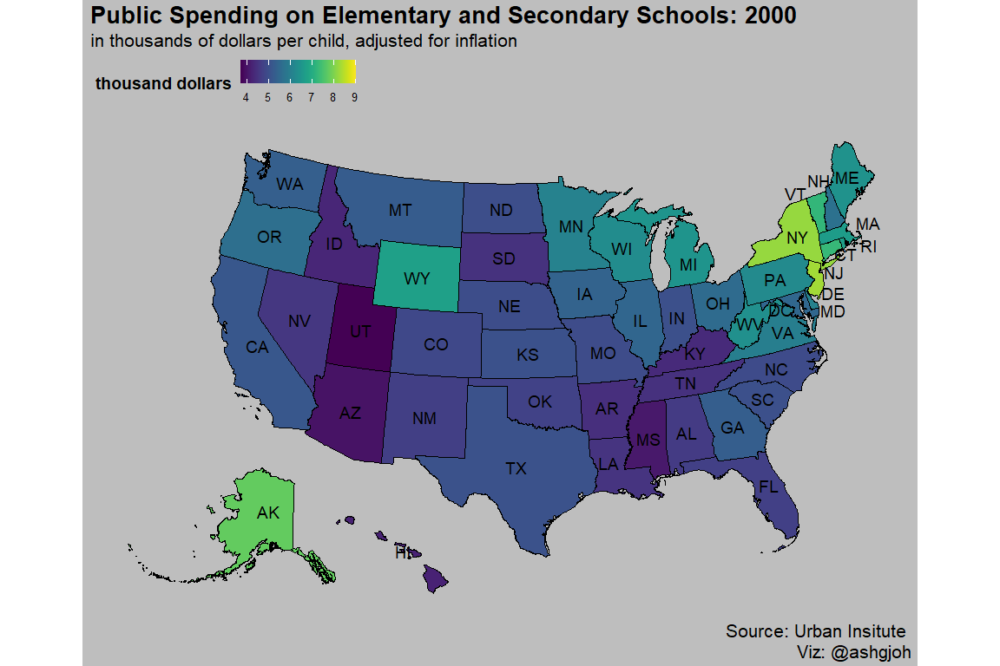

Tidy Tuesday: 9/15/2020 - US Spending on Kids
================
Ashlyn Johnson
9/15/2020

## Packages

``` r
library(tidyverse)
library(tidytuesdayR)
library(viridis)
library(urbnmapr)
```

## Data

This week’s data comes from the Urban Institute and we will use Joshua
Rosenberg’s package, `tidykids` to access the data. The dataset provides
information on public spending on children from 1997 - 2016. The
`tidykids` package contains a cleaned and tidy version of the data.

``` r
dat <- tidytuesdayR::tt_load(2020, week = 38)
kids <- dat$kids %>% 
  rename(state_name = state)
```

**inf\_adj** is the value adjusted for inflation and
**inf\_adj\_perchild** is the value adjusted for inflation per child.

### Initial Plots to Check Out the Data

``` r
ggplot() + geom_area(data = kids %>% filter(variable == "PK12ed"), aes(x = year, 
    y = inf_adj_perchild, fill = state_name), show.legend = FALSE) + scale_fill_viridis(discrete = TRUE) + 
    theme_classic() + labs(title = "Public Spending on Elementary & Secondary Schools Per Child by State", 
    subtitle = "in $1000s", xlab = "Year", ylab = "$1000s of Dollars per Child, Adjusted for Inflation") + 
    facet_wrap(~state_name, ncol = 5)
```

<!-- -->

Looking at this initial plot, I am curious to see this data in more
concise way. Can I plot this data onto a map of the US?

``` r
states_sf <- get_urbn_map("states", sf = TRUE)


kids_spatial <- left_join(states_sf,
                          kids %>% 
                            filter(year == 2000, variable == "PK12ed"),
                          by = "state_name")

kids_spatial %>% 
ggplot() +
  geom_sf(mapping = aes(fill = inf_adj_perchild),
          color = "black", size = 0.25) +
  scale_fill_viridis(discrete = FALSE) +
   geom_sf_text(data = get_urbn_labels(map = "states", sf = TRUE), 
                aes(label = state_abbv), color = "black", 
            size = 5) + 
  labs(fill = "thousands of dollars",
        title = "Public Spending on Elementary and Secondary Schools", 
       subtitle = "in thousands of dollars per child, adjusted for inflation") +
  theme(plot.title = element_text(size = 30, face = "bold"),
        plot.subtitle = element_text(size = 20),
        axis.title.x=element_blank(),
        axis.text.x=element_blank(),
        axis.ticks.x=element_blank(), 
        axis.title.y=element_blank(),
        axis.text.y=element_blank(),
        axis.ticks.y=element_blank(),
        panel.grid=element_blank(),
        panel.background = element_rect(fill = 'gray', colour = 'gray'),
        plot.background = element_rect(fill = 'gray', colour = 'gray'), 
        legend.background = element_rect(fill = "gray", color = "gray"))
```

<!-- -->
