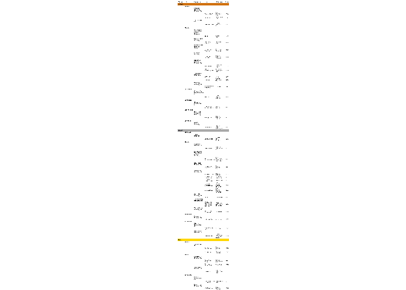

Tidy Tuesday: 10/20/20 - Great American Beer Festival
================
Ashlyn Johnson
10/26/2020

``` r
library(tidyverse)
library(tidytuesdayR) 
library(flextable)
library(officer)
library(webshot2)
```

This week’s Tidy Tuesday data comes from the Great American Beer
Festival (GABF). There are many different categories of beers and within
each category a bronze, silver, or gold medal can be awarded.

### Getting the Data

``` r
tuesdata <- tidytuesdayR::tt_load(2020, week = 43)
```

    ## 
    ##  Downloading file 1 of 1: `beer_awards.csv`

``` r
beer_awards <- tuesdata$beer_awards
```

### Exploration using a table

Being that I live in Georgia currently, I am interested to know how
successful Georgia beers have been in the GABF. First, I’ll use the
`flextable` package to make a table of the winning Georgia beers.

``` r
ga_beer_table <- beer_awards %>%
  filter(state == "GA") %>%
  select(-state) %>%
  mutate(medal = factor(medal, levels = c("Bronze", "Silver", "Gold"))) %>%
  arrange(medal, city, brewery, year) %>%
  rename(
    Medal = medal,
    City = city,
    Brewery = brewery,
    Beer = beer_name,
    Category = category,
    Year = year
  ) %>%
  as_grouped_data(groups = c("Medal", "City", "Brewery")) %>%
  flextable() %>%
  colformat_char(j = "Year", na_str = "") %>%
  bg(i = ~ Medal == "Bronze", bg = "#d0700e") %>%
  bg(i = ~ Medal == "Silver", bg = "darkgray") %>%
  bg(i = ~ Medal == "Gold", bg = "gold") %>%
  bold(part = "header") %>%
  bold(j = c("Medal", "City", "Brewery")) %>%
  fontsize(size = 16, part = "header") %>%
  fontsize(i = ~ Medal %in% c("Bronze", "Silver", "Gold"),
           size = 15) %>%
  fontsize(j = "City", size = 14) %>%
  fontsize(j = "Brewery", size = 13) %>%
  fontsize(j = c("Beer", "Category", "Year"), size = 12) 
  
plot(ga_beer_table)
```

    ## Registered S3 method overwritten by 'webshot':
    ##   method        from    
    ##   print.webshot webshot2

<!-- -->
