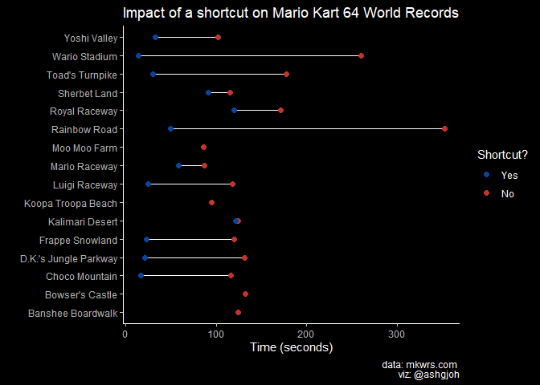

Tidy Tuesday: 5/26/21 - Mario Kart 64 World Records
================
Ashlyn Johnson
5/26/2021

``` r
library(tidyverse)
library(tidytuesdayR)
library(ggdark)
```

``` r
tuesdata <- tidytuesdayR::tt_load(2021, week = 22)
```

    ## --- Compiling #TidyTuesday Information for 2021-05-25 ----

    ## --- There are 2 files available ---

    ## --- Starting Download ---

    ## 
    ##  Downloading file 1 of 2: `drivers.csv`
    ##  Downloading file 2 of 2: `records.csv`

    ## --- Download complete ---

``` r
records <- tuesdata$records
```

On which track does a shortcut save the most time?

First, let’s get the current records for each track, with and without a
shortcut.I determined the current record by isolating the minimum time
for each track.

``` r
records_shortcut_comparison <- records %>% 
  filter(type == "Three Lap") %>% 
  group_by(track, shortcut) %>% 
  summarize(current_record = min(time)) %>% 
  mutate(shortcut = factor(shortcut, levels = c("Yes", "No")))
```

    ## `summarise()` has grouped output by 'track'. You can override using the `.groups` argument.

``` r
records_shortcut_comparison
```

    ## # A tibble: 28 x 3
    ## # Groups:   track [16]
    ##    track                 shortcut current_record
    ##    <chr>                 <fct>             <dbl>
    ##  1 Banshee Boardwalk     No                124. 
    ##  2 Bowser's Castle       No                132  
    ##  3 Choco Mountain        No                116. 
    ##  4 Choco Mountain        Yes                17.3
    ##  5 D.K.'s Jungle Parkway No                132. 
    ##  6 D.K.'s Jungle Parkway Yes                21.4
    ##  7 Frappe Snowland       No                120. 
    ##  8 Frappe Snowland       Yes                23.6
    ##  9 Kalimari Desert       No                124. 
    ## 10 Kalimari Desert       Yes               122. 
    ## # ... with 18 more rows

Let’s make a graph!

``` r
ggplot(records_shortcut_comparison, aes(y = track, x = current_record)) + 
  geom_line() + 
  geom_point(aes(color = shortcut), size = 2) + 
  scale_color_manual(values = c("#08469E","#C2352D")) +
  labs(x = "Time (seconds)", y = "", title = "Impact of a shortcut on Mario Kart 64 World Records", color = "Shortcut?") +
  dark_theme_classic()
```

    ## Inverted geom defaults of fill and color/colour.
    ## To change them back, use invert_geom_defaults().

<!-- -->
